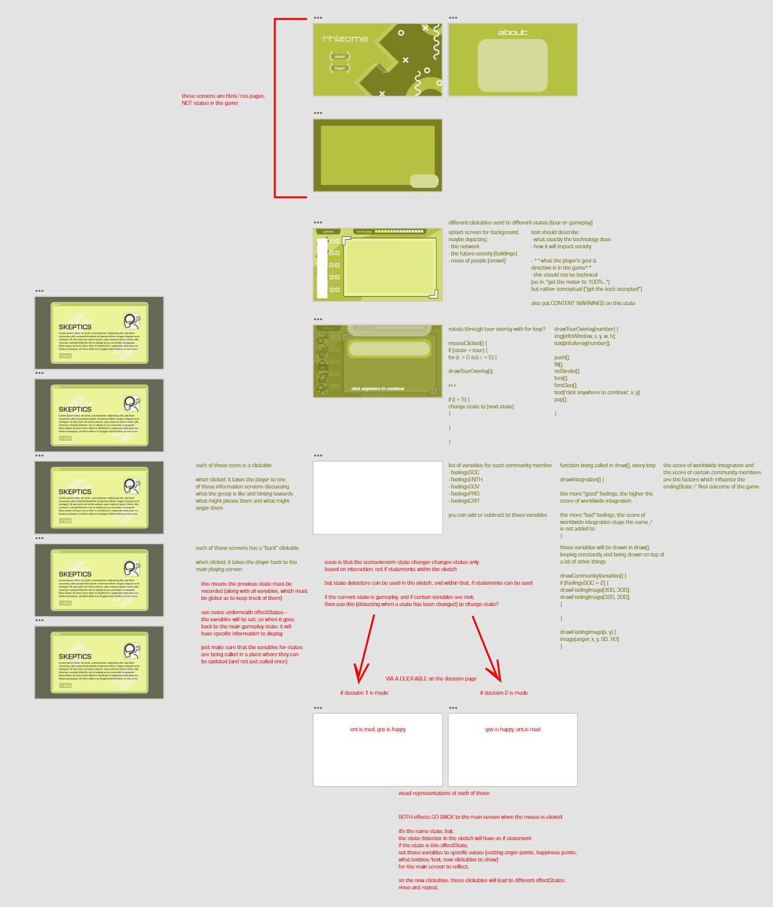

## ART385 Project 3
##### May 13, 2021
by Maj Jenkins

Hosted currently at https://xarts.usfca.edu/~mrjenkins/art385/project3/

### About

### Overview

### XD Wireframe Link

### Technical Details
##### assets

##### libraries
This game uses multiple add-on libraries for p5.js.
* p5.clickable by Lartu
* p5.play by Paolo Pedercini / @molleindustria
* p5.timer by Scott Kildall
* p5.adventure manager by Scott Kildall

##### fonts
Changeling Neo

Eurostile

Raleway

##### sfx

#### development
