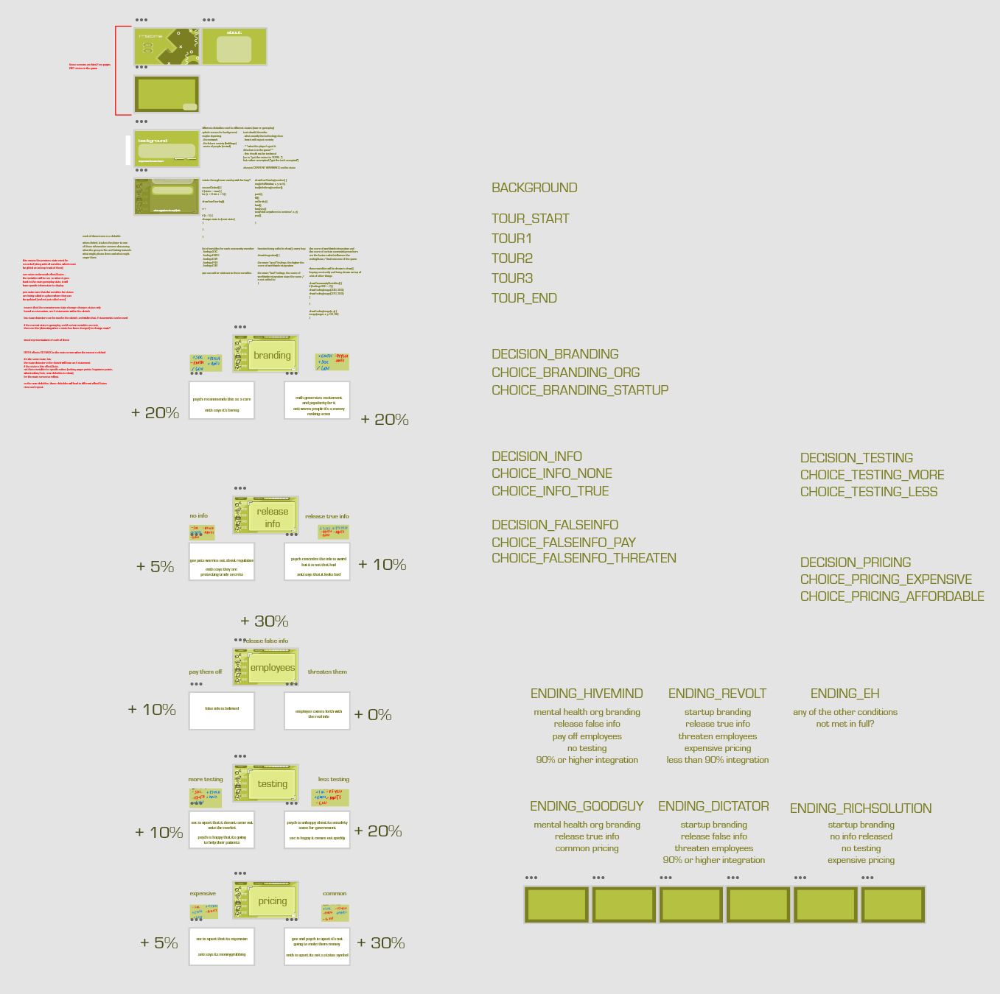

## ART385 Project 3
##### May 13, 2021
by Maj Jenkins

Hosted currently at https://xarts.usfca.edu/~mrjenkins/art385/project3/

### About
In a future century where a 70-hour workweek is the norm, people all over the globe are beginning to feel the generational effects of stress resulting in social isolation. Loneliness, once conceived of by the public as a simple unfortunate nuisance, is now the silent killer of many through deterioration of mental health.

In order to survive this “loneliness epidemic,” humanity (refusing to alter its social structure) turns to biotechnological innovations to solve its problems. By inserting a small sample of modified fungal tissue into participants’ heads, one company has the solution: The Interface, a global network of human minds, made possible by combining the capabilities of the human mind with that of vast underground fungal networks. By integrating oneself with The Interface, one will never be alone again; their thoughts, desires, and needs are inherently shared with their peers. 

### Overview

The game consists of multiple decisions that one must make in terms of how the company that owns The Interface will function. There are ethical and economical dilemmas involved in this decision-making. The user’s decisions affect both public opinion (opinion that the aforementioned populations have of the company) as well as the amount of the world’s overall population that has integrated into The Interface. The choices the player makes and the scores they affect will decide which of the six possible endings they get at the end of the game.

### XD Wireframe Link

https://xd.adobe.com/view/e061ec07-c25f-4f3e-84f5-1e31a9f89015-b532/

### Technical Details
##### how to get each ending
Hivemind Ending:
* Brand as an organization
* Use false information, and pay employees off.
* Do less testing.
* Make it affordable.
* Get integration to above 70%.

Goodguy Ending:
* Brand as an organization.
* Use true information.
* Do more testing.
* Make it affordable.

Revolt Ending:
* Brand as a startup.
* Use false information, and threaten employees.
* Do less testing.
* Make it expensive.
* Get Skeptics' anger to 2 or over.

Dictator Ending:
* Brand as a startup.
* Censor information.
* Do more testing.
* Make it expensive.

Rich Solution Ending:
* Brand as a startup.
* Use true information.
* Do more testing.
* Make it expensive.
* Get integration to under 70%.

##### assets
Music from Introductory Video:
* *Dramatic background music for news, documentary - Dramatic News \ instrumental music for youtube* by SnowMusicStudio (Apr 28, 2020). YouTube.
* https://www.youtube.com/watch?v=2DAVD4B7Yrs

Newscaster Voices created with Play.ht.
* https://play.ht/text-to-speech-voices/newscaster-voices/

Mushroom 3D Model:
* *Golden Mushroom* by ibrahim alrifai on Turbosquid
* https://www.turbosquid.com/3d-models/free-golden-mushroom-3d-model/921519

Button SFX:
* *Button Beep Sound Effects All Sounds* by All Sounds (Apr 10, 2018). YouTube.

##### libraries
This game uses multiple add-on libraries for p5.js.
* p5.clickable by Lartu
* p5.play by Paolo Pedercini / @molleindustria
* p5.timer by Scott Kildall
* p5.adventure manager by Scott Kildall

##### fonts
Changeling Neo
* https://fonts.adobe.com/fonts/changeling-neo

Eurostile
* https://fonts.adobe.com/fonts/eurostile

Raleway
* https://fonts.adobe.com/fonts/raleway

#### development
Creative and asset development for this project.

#### video
Assets and project files for the short introductory video.